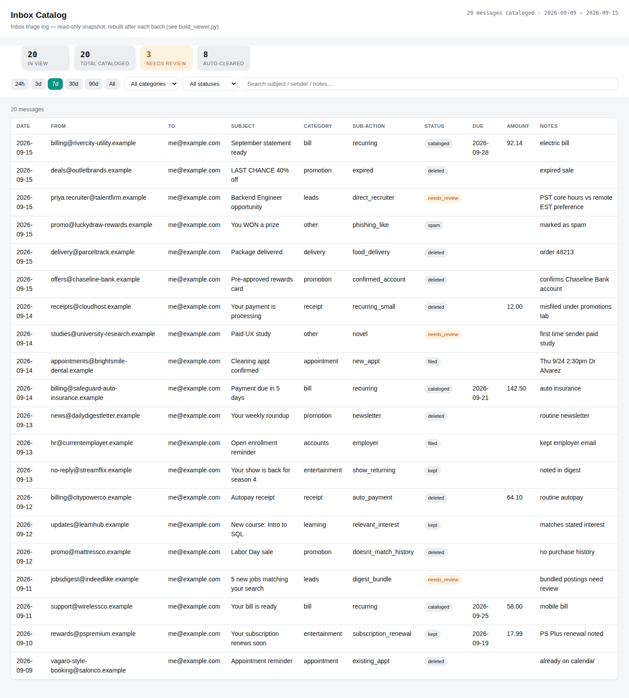

# Email Manager

**A Claude Skill that turns Claude into a personal executive assistant for your inbox** — triaging email into a durable, reviewable catalog instead of a black box. Every message gets logged before any action is taken, routine clutter gets cleared automatically, anything ambiguous gets flagged for you instead of guessed at, and bills/known accounts get tracked into a simple running ledger.

This is a [Claude Skill](https://www.anthropic.com/news/skills) — a packaged set of instructions, reference docs, and scripts that Claude loads to perform a specific workflow reliably. Drop `email-manager.skill` into a Claude Skills folder (or unzip it into `skills/email-manager/`) and Claude picks up the whole workflow: setup interview, safety rules, categorization, the finance ledger, and a self-contained HTML catalog viewer.

## Why a catalog, not just actions

Most "AI inbox cleanup" demos just take actions and hope you trust them. This skill is built around a different premise: **log first, act second, and never guess on anything ambiguous.**

- Every message gets a row in `catalog.csv` — the audit trail — before or as part of any action taken on it.
- Nothing gets permanently deleted without your approval. "Delete" always means trash (recoverable) until you've explicitly confirmed a category is safe to auto-clear.
- Anything Claude isn't confident about gets flagged `needs_review` rather than silently actioned.
- The catalog is rendered into a sortable, filterable, self-contained HTML page — no server, no database, just one file you can open or host anywhere.

## What it does

- **Categorizes** every message against rules you define together with Claude on first use (bills, leads, promotions, deliveries, appointments, receipts, and anything else specific to your inbox) — not a fixed taxonomy, a starting template you customize.
- **Tracks bills and recurring accounts** into a lightweight finance ledger, with calendar reminders for due dates.
- **Builds a catalog viewer** (`assets/viewer.html`) — stat cards, category chips, a status filter, date-range buttons, search, and a sortable table, regenerated after every batch by `scripts/build_viewer.py`.
- **Handles a real backlog**, not just a handful of messages — chunked processing with a durable resume point, and optional parallel subagents for large backlogs (each scoped to a disjoint chunk, merged into one catalog and one consolidated report).
- **Supports multiple mailboxes** (personal + work, say) — either as fully separate workspaces, or as one unified catalog with an `account` column and an account filter that appears automatically in the viewer.
- **Works two ways**: point it at a live Gmail/Calendar MCP connection for ongoing, hands-off triage, or just export/forward a batch of email with no connector setup at all — a genuinely useful way to try the workflow before committing to live account access.
- **Automates itself over time** — once the category rules are validated against real inbox behavior, the same workflow can run on a schedule and just deliver a daily digest.

## The catalog viewer

A single self-contained HTML file — no build step, no server. Below is a demo render against a mock 20-message catalog (bundled with the skill's eval suite, not real email):



## Setup

1. Install the skill (drop the `.skill` file into your Claude Skills folder, or point Claude at this repo).
2. First run walks you through a short interview: categories, what counts as "safe to auto-delete," known accounts to track, and inbox aliases.
3. Choose your access path:
   - **No connector**: export or forward a batch of email and Claude triages it directly — no setup required, at the cost of live mailbox actions and calendar writes.
   - **Live connector**: wire up Gmail/Calendar access via the open-source [Google Workspace MCP server](https://github.com/taylorwilsdon/google_workspace_mcp) — full setup steps (including multi-account configuration) are in `references/setup.md`.

Permissions are scoped deliberately: read, organize (label/archive/trash), and draft replies — but never send. Claude can prep a reply; a human hits send.

## Repository layout

```
SKILL.md                    the skill definition Claude loads (frontmatter + full workflow)
references/
  setup.md                  Gmail/Calendar MCP setup, including multiple accounts
  schema.md                 catalog.csv column reference, multi-account patterns
  categories.md             example category rules to fork and customize
  finance.md                ledger.csv format and what to capture
scripts/
  build_viewer.py           regenerates assets/viewer.html from catalog.csv
assets/
  viewer.html               the clean starting template for the catalog viewer
evals/                      the eval suite used to validate this skill (see below)
```

## Validated with Claude's eval loop, not just vibes

This skill was built and iterated using Anthropic's skill-creator eval workflow: three scenario evals (first-time setup interview, a mock batch-triage-and-calendar run, and a daily digest), each run multiple times with the skill loaded and without it, then graded against explicit expectations.

| Metric | With skill | Without skill | Delta |
|---|---|---|---|
| Pass rate | 100% ± 0% | 81% ± 17% | +19 pts |
| Response time | 75.2s ± 26.7s | 61.7s ± 3.6s | +13.5s |
| Tokens used | 56,252 ± 4,027 | 47,829 ± 1,314 | +8,423 |

The skill trades a bit of extra time/tokens (it's doing more — logging, categorizing, safety checks) for a materially more consistent, safer outcome across repeated runs. Full eval definitions and mock fixtures are in `evals/`.

## Notes on the source material

This skill is a genericized version of a personal inbox-automation workflow originally built for one person's real Gmail. Every example in `references/categories.md`, every mock message in `evals/files/`, and the screenshot above use invented or synthetic data — no real email content, sender, or personal detail from the original deployment is included here.

## License

MIT — see [LICENSE](LICENSE).
